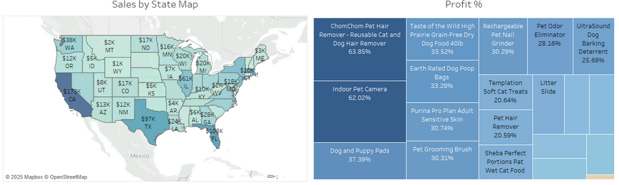

E-commerce Sales & Shipping Cost Analysis (Tableau)

A data-driven approach to optimizing E-commerce sales and shipping strategies 
Overview

This project provides an end-to-end E-commerce analytics solution using Tableau, focusing on sales performance, profitability, customer lifetime value (LTV), and shipping cost optimization for a fictitious online pet supply store, Munchy’s. The analysis identifies key trends in customer purchasing behavior, market basket relationships, and opportunities for reducing operational costs.

Key Questions:

    What are the top-selling and most profitable products?
    How does customer LTV vary across states?
    What cross-sell opportunities exist between frequently bought items?
    How can bulk purchases and shipping strategy optimize costs?
    Which states and products contribute most to shipping expenses?

This project employs interactive dashboards to deliver actionable business insights that increase profitability and optimize operations in an E-commerce setting.
Objectives

✅ **Analyze sales performance & profitability across different product categories.**
✅ **Identify top-performing products based on revenue & margins.**
✅ **Conduct Market Basket Analysis to uncover cross-selling opportunities.**
✅ **Evaluate customer distribution by state and Lifetime Value (LTV) trends.**
✅ **Optimize shipping costs by identifying expensive routes & bulk purchase strategies.**
✅ **Provide strategic recommendations for revenue growth & cost reduction.**
Key Findings & Visualizations
1. Sales & Profitability Trends

Dashboard:

    Pet food and disposable products generate the highest revenue.
    Electronics (pet cameras) have highest profit margins (62%), outperforming other categories.
    Some products, despite high sales, have lower profit margins, requiring pricing adjustments.

2. Customer Distribution & LTV Insights

Dashboard:

    Texas, California, and Florida have the highest LTV customers, making them prime candidates for targeted marketing campaigns.
    Customers from high-LTV states contribute to long-term profitability and repeat purchases.
    

3. Market Basket Analysis (Cross-Sell Opportunities)

Dashboard:

    Dog Poop Bags and Memory Foam Pet Beds show a strong correlation, indicating a potential bundle offer.
    UltraSound Dog Barking Deterrent & Premium Dog Food are often bought together, providing upsell potential.
    Cross-sell recommendations could increase the average order value and customer retention.
    

4. Shipping Cost Analysis (State-wise Distribution & Per Product Costing)

Dashboard:

Dashboard:

    The East Coast accounts for nearly 50% of shipping costs, suggesting the need for an additional distribution center in that region.
    Shipping single-unit products significantly increases costs—bulk purchasing discounts should be encouraged.
    High shipping costs for lightweight products suggest package optimization strategies.

    

5. Shipping Optimization - Cost Savings Simulation

Dashboard:

    A "What-if" scenario shows that shipping in bulk reduces costs by $58,113, optimizing expenses for both customers and the business.
    Businesses should encourage higher quantity purchases to leverage cost savings and logistics efficiency.
    

6. State-wise Sales Performance & Profitability

Dashboard:

    Geographical analysis reveals that states with the highest sales don’t always yield the highest profit margins.
    Insights from state-wise sales performance can help refine regional marketing strategies.

    

## **Strategic Recommendations**

**Based on our analysis, we propose the following business strategies:**
1️⃣ **Expand marketing campaigns in high-LTV states (Texas, California, Florida) to increase repeat purchases.**
2️⃣ **Create bundle offers for frequently bought-together items (cross-sell strategy).**
3️⃣ **Encourage bulk purchases through discounts to reduce per-unit shipping costs.**
4️⃣ **Optimize packaging and weight-based pricing to minimize high shipping expenses.**
5️⃣ **Consider a new fulfillment center on the East Coast to cut shipping times and costs.**
